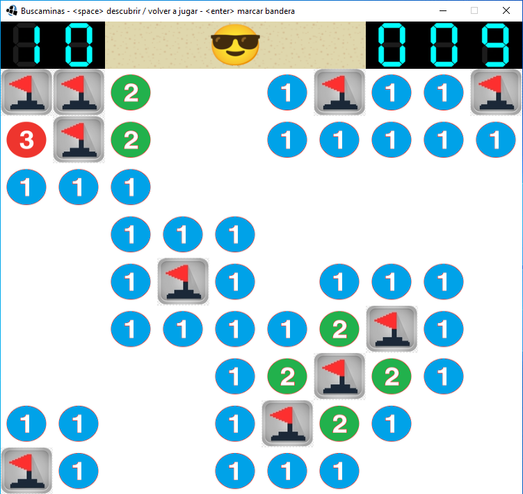
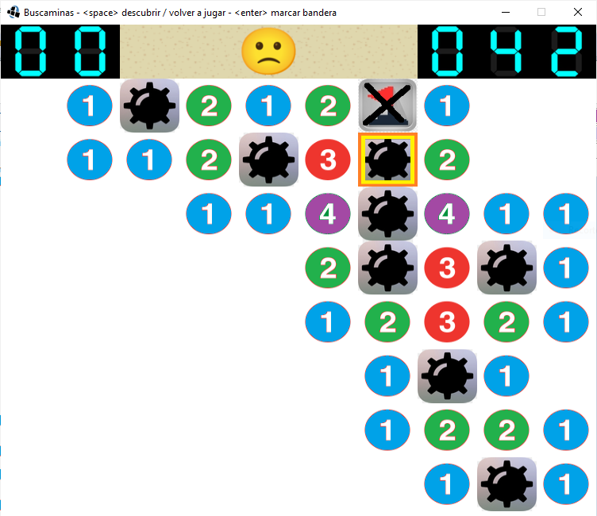

# Buscaminas

## Juego realizado con la biblioteca Wollok Game

### Instrucciones:

- Para descubrir celdas libres <Space> 
- Para marcar (o desmarcar) con banderas donde hay minas <Enter>
- Para desplazarse, usar las flechas del teclado.
- Al terminar, para jugar nuevamente <Space>.

_Partida ganada:_

_Partida perdida:_

### Acerca de:

Autores: Alfonso

Versión de wollok: 2.0.2

Fecha: Noviembre 2020

